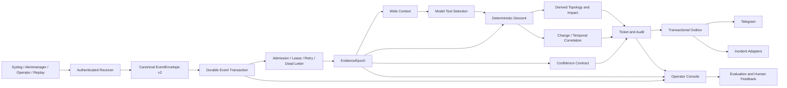
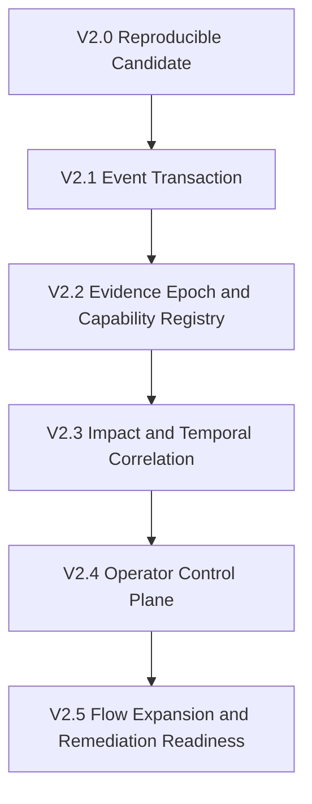

# Version 2 Architecture and Execution Plan

**Date:** 2026-08-23  
**Status:** V2.1a isolated event-store foundation implemented; later slices require separate approval  
**Scope:** `ios-xr-nettools` Version 2  
**Authority:** [`BACKLOG.md`](BACKLOG.md) remains authoritative for existing backlog IDs and states. This document defines the V2 target architecture, sequencing, gates, and acceptance criteria.

## 1. Executive decision

Version 1 established the right architectural foundation:

- deterministic code owns network facts, findings, targets, and causal chains;
- models select from bounded tools and explain code-owned outcomes;
- device commands are read-only, allowlisted, and parameterized by reconstruction;
- model ingress is pinned and model egress is projected;
- evidence absence, collection failure, and incoherence are never reported as healthy;
- event admission, tickets, notification lifecycle, and provider comparisons are measurable.

Version 2 does **not** replace that foundation. It turns the existing supervised
diagnostic system into a coherent operational platform. The priority is durable
event handling, reusable evidence, explicit capability policy, service impact,
and measurable operator trust. More protocols, more model providers, and
autonomous remediation come later.

The V2 outcome is:

> A durable event transaction receives one authenticated event, admits it once,
> collects one coherent evidence epoch, produces one deterministic finding,
> records one auditable ticket, computes service impact, and delivers one
> lifecycle through policy-controlled integrations.

## 2. Current baseline

The baseline for this plan is the working application reviewed and tested on
2026-08-23.

### 2.1 Capabilities already present

- Four deterministic investigation flows: interface, BGP session, IS-IS
  adjacency, and LDP session.
- Shared IOS-XR parsing and deterministic trigger routing.
- One promoted investigation-only BGP trigger.
- Stable transport-independent event identity.
- Atomic event admission across identity, device budget, and fabric budget.
- Retryable event failure state after tool or ticket-lifecycle failures.
- Pinned model tool arguments and projected model evidence.
- Filesystem-backed tickets, evidence, admission, metrics, and lifecycle state.
- Telegram root/reply lifecycle with private locked state and explicit
  at-least-once semantics.
- Loki, Alertmanager, Prometheus, NetBox, and MCP integration surfaces.
- Offline fixture execution, live read-only execution, mutation guards,
  packaging checks, and generated architecture facts.

### 2.2 Latest validation baseline

- Full suite: **3,790 passed, 22 skipped**.
- Ruff: clean.
- MiniMax M3 and DeepSeek via OpenRouter both reached deterministic answers in
  the matched live read-only comparison.
- Ordinary corpus, three runs each:
  - MiniMax: 3/3 normal completion, 10 total tool calls.
  - DeepSeek: 1/3 normal completion, 20 total tool calls; deterministic answer
    still recorded in 3/3.
- Adversarial corpus, three runs each:
  - both providers: zero wrong-device/peer/interface attempts;
  - MiniMax: 2/3 normal completion;
  - DeepSeek: 3/3 normal completion.

These samples establish control behavior, not model superiority. Provider
selection remains policy-driven and subject to a larger versioned corpus.

### 2.3 Known limitations entering V2

- Runtime state is split across several storage conventions.
- Event lifecycle is coordinated across files rather than one durable record.
- MCP capability and object semantics remain partly inferred from function
  signatures and independent policy tables.
- The same investigation can perform overlapping collections at multiple
  boundaries.
- Topology exists primarily as inventory and per-device observations, not a
  service-impact graph.
- Historical metrics, changes, and event episodes are context, but are not yet
  a unified temporal evidence axis.
- Operator feedback, retries, dead letters, and evidence lineage lack one
  supported console.
- Confidence is represented through several fields but not one explicit,
  multidimensional contract.

## 3. V2 goals and non-goals

### 3.1 Goals

1. Make event intake and processing durable, retryable, observable, and
   reproducible.
2. Reuse one coherent evidence epoch across validation, wide context,
   deterministic descent, and verification.
3. Declare every exposed capability and its safety/evidence contract in one
   validated registry.
4. Add deterministic service-impact and blast-radius analysis from a derived
   topology graph.
5. Add historical/change correlation without allowing correlation to become an
   unsupported causal claim.
6. Expose evidence confidence as structured dimensions.
7. Give operators a supported control plane for events, tickets, retries,
   silences, evidence lineage, and evaluation.
8. Measure quality, latency, spend, and operator acceptance continuously.
9. Prepare, but do not prematurely enable, human-approved remediation.

### 3.2 Non-goals

- No general command execution surface.
- No model-authored device, object, command, diagnosis, or procedure.
- No model-generated causal finding replacing deterministic descent.
- No manually authored second topology source.
- No vector database before corpus size and retrieval quality require it.
- No broad protocol expansion without real broken evidence and a valid
  dependency ladder.
- No fully autonomous remediation in V2's initial release.
- No multi-tenant network service before identity, RBAC, tenant isolation, and
  secret management are designed and tested.

## 4. Governing architecture principles

### P1. Deterministic authority

Models may select approved capabilities and explain results. Code owns:

- device and object identity;
- command rendering;
- evidence coverage and freshness;
- rung verdicts and findings;
- causal-chain membership;
- effect policy and workflow state.

### P2. Four-property capability contract

Every capability declares four independent properties:

1. **Scope:** fabric, device, object, or external system.
2. **Authority:** context, deterministic verdict, or side effect.
3. **Evidence contract:** source, freshness, coverage, and coherence required.
4. **Effect class:** passive read, active probe, external write, or network
   mutation.

Wide/narrow remains useful, but it is not sufficient by itself.

### P3. One event, one transaction

Transport provenance must not create a second incident identity. Receiver,
Loki replay, and collector retry all converge on one versioned event envelope
and one lifecycle record.

### P4. One investigation, one evidence epoch

Collection is owned by a request-scoped epoch. A capability consumes that
epoch or explicitly declares why it needs a fresh read. Cached evidence carries
source and age and participates in coherence checks.

### P5. Derived projections, never competing truth

Topology graphs, caches, search indexes, and dashboards are projections of
authoritative inventory and collected evidence. They are rebuildable and are
never edited as independent sources of network truth.

### P6. Side effects behind workflows

Notifications, incident updates, annotations, approvals, and future network
actions use declared workflows with idempotency, audit, and destination policy.
The model selects a workflow; it never composes its steps.

### P7. Absence is never zero

Missing samples, failed collection, incomplete queries, unknown objects, and
state corruption remain explicit states. None may collapse into a healthy or
empty result.

### P8. Evidence before capability growth

Add a flow or action only after a versioned corpus demonstrates the object,
failure mode, lowest broken layer, and negative controls.

## 5. Target architecture



### 5.1 Canonical EventEnvelope v2

Required fields:

- `schema_version`;
- canonical `event_id` and optional upstream IDs;
- source provenance and authenticated receiver identity;
- device, object type, subject, mnemonic, transition;
- canonical message fields and contained raw trigger;
- device time, trusted receive time, ingest time, and clock quality;
- first seen, last seen, duplicate count;
- trigger-policy version.

Source kind is provenance, not identity.

### 5.2 Durable Event Transaction

Required states:

```text
received
  -> admitted
  -> running
  -> completed
  -> retryable_failed -> admitted
  -> terminal_failed
  -> dead_letter
```

The transaction records:

- attempt number;
- lease owner and expiry;
- admission decision and budget snapshot;
- ticket ID;
- evidence epoch ID;
- provider and tool-call accounting;
- deterministic result;
- notification/outbox state;
- terminal reason.

SQLite in WAL mode is the default candidate for a single-host deployment. The
storage interface must not assume SQLite so a later service deployment can use
PostgreSQL without changing domain semantics.

### 5.3 EvidenceEpoch

The epoch owns:

- one request deadline;
- collected-at timestamps;
- per-device/per-intent evidence;
- connection and read counts;
- cache source and age;
- coverage gaps;
- parser status;
- clock quality;
- coherence re-reads;
- source agreement;
- remaining time budget.

The deterministic descent consumes the epoch. MCP detail tools may query it.
Object validation must not trigger a second full collection when the epoch
already proves the object.

### 5.4 Capability Registry

Each capability row declares:

```text
name
surface: classic | staged | internal | workflow
model_visible: bool
scope: fabric | device | object | external
authority: context | verdict | side_effect
effect: passive | active_probe | external_write | network_write
device_parameter
object_kind
object_parameter
object_semantics: asserted | lookup | none
evidence_requirements
freshness_class
timeout_class
budget_class
result_schema
workflow_or_handler
```

Startup fails if a model-visible capability is missing a required declaration
or if policy tables disagree. MCP schemas, model pinning, planning manifests,
docs, and parity tests derive from this registry.

### 5.5 Derived topology and service graph

The graph is built from:

- inventory identities and roles;
- parsed LLDP/CDP/IS-IS adjacencies;
- BGP sessions and address families;
- routes, next hops, and SR/LDP relationships;
- VRFs, route targets, and service membership when available;
- evidence timestamps and source confidence.

It supports deterministic queries:

- what depends on this object;
- which services and peers are affected;
- whether a redundant path remains;
- which observed failures share a structural dependency;
- which object should be investigated next.

Neo4j is optional. The domain graph must work through an interface and remain
derived/rebuildable.

### 5.6 Temporal and change evidence

Historical evidence includes:

- bounded syslog episodes;
- configuration diffs and change windows;
- deployment and maintenance records;
- utilization, loss, CPU, and queue trends;
- prior deterministic findings and operator outcomes.

Correlation output uses explicit classes:

- `observed_before`;
- `observed_after`;
- `coincident`;
- `structurally_related`;
- `possible_contributor`;
- `causally_proven` only when deterministic evidence establishes it.

Historical windows frame a diagnosis; they do not silently become current
rung evidence.

### 5.7 Confidence Contract

Every terminal result reports:

- `finding` and `cause`;
- `evidence_complete`;
- `freshness`;
- `temporal_coherence`;
- `source_agreement`;
- `parser_certainty`;
- `clock_quality`;
- `scope_resolved`;
- `limitations`;
- derived `trustworthy`, retained for compatibility.

The derived boolean is never the only confidence information available.

### 5.8 Operator Console

Minimum supported workflows:

- search events and tickets;
- inspect event, evidence, model, and notification lineage;
- view open, running, retryable, completed, and dead-letter events;
- retry an eligible event;
- acknowledge, silence, or assign ownership;
- compare deterministic findings over time;
- inspect service impact and topology path;
- record operator confirmation, correction, or false-page outcome;
- compare provider quality and cost;
- show state/persistence/collector health.

The first implementation may be a local server-rendered interface. It must not
introduce inbound action authority without authentication.

### 5.9 Transactional Outbox and integrations

One outbox handles Telegram and future adapters. Required adapters are added
only after the common contract is stable:

1. Telegram;
2. generic signed webhook;
3. one operator-selected incident system;
4. optional Slack/Teams/PagerDuty/ServiceNow/Jira adapters.

Outbox records destination policy, payload schema, attempt count, provider
receipt, retry state, and final disposition. Provider limitations are stated
honestly: at-least-once where provider idempotency is unavailable.

### 5.10 Continuous Evaluation

Evaluation separates:

- deterministic diagnosis correctness;
- model tool-selection behavior;
- grounding and report fidelity;
- notification correctness;
- operator acceptance;
- cost and latency.

Provider routing is considered only after a larger corpus supports it. The
initial policy remains one selected provider per run, with deterministic output
independent of provider choice.

## 6. Execution model

V2 is delivered through six gated phases. A later phase may begin discovery in
parallel, but it may not ship against an unmet gate.



## 7. Phase V2.0 — Reproducible candidate

**Purpose:** establish a reviewable baseline before architectural extraction.

### Tasks

| ID | Task | Deliverable |
|---|---|---|
| V2-001 | Separate behavior changes from documentation/evidence cleanup | Reviewable commit series |
| V2-002 | Remove runtime artifacts from the checkout and define state layout | State directory manifest |
| V2-003 | Reconcile retained docs and stale references | One current docs map |
| V2-004 | Run full offline gates and installed-artifact checks | Signed validation record |
| V2-005 | Run one controlled live read-only acceptance | Versioned receipt |
| V2-006 | Tag the accepted V2 baseline candidate | Reproducible revision and artifact hashes |

### Gate V2.0

- clean or intentionally enumerated worktree;
- tests, lint, mutation guards, coverage, wheel, container, and offline demo
  green;
- no runtime state appears in `git status` after a normal run;
- configuration schema and artifact digests recorded;
- rollback point exists.

## 8. Phase V2.1 — Durable event transaction

**Purpose:** make unattended event processing recoverable and observable.

### Tasks

| ID | Task | Deliverable |
|---|---|---|
| V2-101 | Define `EventEnvelopeV2` and migration from current decisions | Typed schema and converters |
| V2-102 | Build authenticated receiver contract | Validation, trusted receive time, source identity |
| V2-103 | Implement event repository and lifecycle state machine | Transactional event store |
| V2-104 | Add lease, retry, backoff, and dead-letter semantics | Crash-safe worker behavior |
| V2-105 | Bind ticket lifecycle to the event transaction | One event/ticket terminal contract |
| V2-106 | Replace notification state with transactional outbox | Destination-scoped delivery records |
| V2-107 | Migrate current filesystem state safely | Versioned migration and rollback |
| V2-108 | Add event and outbox health metrics | Operational SLIs |

### Required failure tests

- duplicate direct-syslog/Loki representations;
- receiver restart and replay;
- process death before and after ticket creation;
- process death before and after provider delivery;
- lease expiry and competing workers;
- provider timeout and partial multi-destination delivery;
- corrupt, missing, and permission-denied state;
- retry budget exhaustion and dead-letter creation;
- completed event replay creates no second ticket or page.

### Gate V2.1

- one canonical event produces at most one active transaction and ticket;
- every non-terminal event is recoverable after process restart;
- no retryable failure is consumed as a completed duplicate;
- outbox behavior is documented as exactly-once where supported and
  at-least-once otherwise;
- stuck-running and dead-letter conditions are observable.

## 9. Phase V2.2 — Evidence epoch and capability registry

**Purpose:** improve temporal correctness, performance, and policy completeness
with one request context and one capability declaration.

### Tasks

| ID | Task | Deliverable |
|---|---|---|
| V2-201 | Define typed `EvidenceEpoch` and evidence-result models | Versioned domain types |
| V2-202 | Route deterministic investigation through one epoch | No behavior change |
| V2-203 | Reuse epoch for MCP object validation and detail calls | Reduced duplicate collection |
| V2-204 | Add epoch-aware cache interface | Freshness/coherence-preserving cache |
| V2-205 | Define the capability registry | Complete policy schema |
| V2-206 | Generate MCP/model/planning declarations from registry | No independent manifest drift |
| V2-207 | Enforce classic and staged investigation object contracts | End-to-end refusal tests |
| V2-208 | Add connection-count and latency instrumentation | Cold/warm baselines |

### Performance experiment

Measure before and after:

- SSH connections per event;
- collection calls per device/intent;
- p50/p95/p99 event latency;
- object-validation overhead;
- prompt input size;
- cache hit/miss and stale refusal rates;
- deterministic result equivalence.

### Gate V2.2

- deterministic findings are byte-equivalent on the versioned corpus;
- stale cache entries cannot satisfy a fresh evidence requirement;
- plan and run surfaces derive from one capability registry;
- every model-visible parameter has declared treatment;
- connection count and p95 improve, or the change is rejected with evidence.

## 10. Phase V2.3 — Service impact and temporal correlation

**Purpose:** progress from object diagnosis to operational consequence.

### Tasks

| ID | Task | Deliverable |
|---|---|---|
| V2-301 | Define graph entities, edges, evidence, and validity windows | Graph schema v1 |
| V2-302 | Project inventory and observed topology into the graph | Rebuildable graph loader |
| V2-303 | Add path and dependency queries | Deterministic graph API |
| V2-304 | Add blast-radius result contract | Affected objects/services with limitations |
| V2-305 | Define temporal evidence and change-event schemas | Typed historical axis |
| V2-306 | Correlate config/change windows with fault onset | Explicit correlation classes |
| V2-307 | Integrate impact and correlation into tickets | Code-authored sections |
| V2-308 | Build a versioned impact/correlation corpus | Positive and negative controls |

### Gate V2.3

- graph is reproducible from source evidence and contains no authored topology;
- every edge has source, timestamp, and confidence;
- impact never exceeds graph/evidence coverage without a limitation;
- correlation cannot render as causal proof unless deterministic criteria hold;
- simultaneous-subject tests do not merge unrelated incidents.

## 11. Phase V2.4 — Operator control plane and continuous evaluation

**Purpose:** make unattended behavior inspectable, correctable, and measurable.

### Tasks

| ID | Task | Deliverable |
|---|---|---|
| V2-401 | Build event/ticket query API | Read-only control-plane API |
| V2-402 | Build local authenticated operator console | Search and lineage views |
| V2-403 | Add retry, acknowledge, silence, and ownership workflows | Audited operator actions |
| V2-404 | Add provider/run comparison views | Cost, latency, calls, refusals |
| V2-405 | Add operator outcome feedback | Confirmed/corrected/false-page record |
| V2-406 | Build continuous fixture canaries | Scheduled deterministic checks |
| V2-407 | Build safe live read-only canary | End-to-end provider/notification receipt |
| V2-408 | Add policy dry-run and behavioral diff | Trigger/routing/workflow preview |

### Required SLIs

- receive-to-admit and receive-to-finding latency;
- admission refusals by reason;
- duplicate rate by source pair;
- retry, lease expiry, and dead-letter counts;
- open ticket age and incomplete lifecycle count;
- device connections and collection latency;
- model calls, tokens, spend, and limit hits per event;
- deterministic answer, `undetermined`, and coherence-refusal rates;
- notification attempts, confirmations, retries, and duplicates;
- operator confirmation, correction, false-page, and silence rates.

### Gate V2.4

- an operator can explain every terminal result from event to evidence to
  finding to delivery;
- retries and silences are authenticated and audited;
- provider comparison never changes deterministic authority;
- canaries detect a broken provider, MCP surface, notification destination, or
  trigger policy without device mutation.

## 12. Phase V2.5 — Flow expansion and remediation readiness

**Purpose:** deepen capability only after the platform lifecycle is dependable.

### 12.1 Flow selection criteria

A new flow requires:

- real healthy and broken evidence;
- explicit object identity and subject rules;
- a valid dependency ladder;
- absence/unevaluated behavior;
- configuration and observed-state coverage where needed;
- negative controls and simultaneous-fault cases;
- live or fixture acceptance demonstrating the lowest broken layer.

Candidate order, subject to evidence:

1. BFD;
2. L3VPN/VRF service;
3. SR policy;
4. OSPF;
5. EVPN/VXLAN;
6. platform-resource or optical/controller flows.

Protocol count is not a success metric. Honest refusal is preferable to a
nominal flow with insufficient evidence.

### 12.2 Remediation readiness

V2 may design and dry-run remediation plans, but network execution remains
disabled until a separate approval gate is met.

Required plan contract:

- exact target and canonical parameters;
- preconditions and evidence epoch;
- rendered-plan digest and expiry;
- predicted effect and blast radius;
- rollback and compensation;
- post-check and settle deadline;
- approval identity;
- execution-time revalidation;
- append-only audit and manual escalation.

First eligible actions must be reversible, narrowly scoped, and pre-approved.

### Gate V2.5

- plan replay, expiry, changed-state, partial-completion, crash/restart,
  verification-timeout, and unavailable-compensation tests pass;
- no model can author command text or substitute an undeclared target;
- execution remains disabled until separately approved by the operator.

## 13. Cross-cutting engineering work

### 13.1 Typed boundaries

Apply strict typing first to new V2 modules:

- event envelope and transaction;
- evidence epoch;
- capability registry;
- deterministic answer and confidence;
- graph impact result;
- notification/outbox state;
- ticket events and operator actions.

Adopt mypy or pyright incrementally. Do not attempt an all-at-once migration of
the existing codebase.

### 13.2 Secure persistence primitives

Share primitives for:

- private directory/file creation;
- stable lock files;
- unique atomic writes and directory sync;
- bounded reads;
- schema version and migration;
- corruption quarantine;
- health signals;
- retention/compaction.

Do not force append-only logs and transactional state into one storage model.

### 13.3 Module extraction

Refactor behind existing tests, one seam at a time:

- event normalization;
- event repository and worker;
- evidence epoch;
- capability policy and MCP registry;
- ticket lifecycle;
- outbox and adapters;
- CLI command modules.

No broad rewrite is authorized.

### 13.4 Documentation

Retain one current set:

- architecture;
- V2 execution plan;
- backlog;
- process;
- operator/on-call runbook;
- security model;
- evaluation corpus;
- ADRs for durable decisions.

Generate capability, settings, and trigger references from code-owned schemas.
Move dated experiments out of runtime docstrings after their durable lesson is
captured.

## 14. Test strategy

### 14.1 Test classes

| Class | Frequency | Examples |
|---|---|---|
| Pure/domain | Every edit | parsers, checks, state transitions, graph queries |
| Boundary/integration | Every PR | MCP, storage, receiver, outbox, ticket lifecycle |
| Packaging/container | CI | wheel data, installed MCP, offline demo, container startup |
| Fixture acceptance | Every release candidate | complete event corpus, provider behavior |
| Live read-only | Scheduled/release | lab collection, provider, ticket, notification |
| Destructive fault | Reserved campaign only | restore-verified fault injection |

### 14.2 Non-negotiable scenarios

- healthy, broken, unreachable, incomplete, and incoherent evidence;
- replay and duplicate source representations;
- process crashes at each persistence boundary;
- simultaneous related and unrelated subjects;
- model wrong-identity provocation;
- provider timeout, malformed response, and repeated tool requests;
- query cap with `query_complete=false`;
- self-healed event before descent;
- notification partial delivery and retry;
- state migration and rollback;
- stale cache and clock disagreement;
- graph coverage gaps and impact limitation.

### 14.3 Corpus discipline

- Version every corpus and expected result.
- Keep historical scores immutable; append new results after fixes.
- Separate deterministic correctness from model behavior.
- Separate development, regression, and one-shot audit datasets.
- Never report one aggregate accuracy number across different outcome classes.

## 15. Rollout plan

### R0 — Development

- fixture and local state only;
- no unattended intake;
- Telegram test destination only.

### R1 — Shadow

- receive real events but do not page production destinations;
- compare transaction output with current path;
- measure duplicates, latency, and finding parity.

### R2 — Supervised canary

- one trigger, one lab scope, one provider;
- operator present;
- ticket and notification enabled;
- no network mutation.

### R3 — Unattended read-only

- bounded trigger set;
- durable retries/dead letters;
- on-call runbook and kill switch;
- SLI alerts enabled.

### R4 — Workflow integrations

- incident adapters and external annotations;
- destination allowlists and audit;
- no network mutation.

### R5 — Human-approved action pilot

- separate operator approval;
- one reversible action class;
- exact precondition, rollback, and post-check contract.

Each rollout level has a rollback procedure. Promotion never follows only from
elapsed time; it follows from acceptance evidence.

## 16. Risks and controls

| Risk | Control |
|---|---|
| Event transaction becomes a distributed-system rewrite | Start single-host with a narrow repository interface |
| Cache serves stale evidence | Epoch-aware freshness and coherence gates |
| Graph becomes competing truth | Derived-only projection with rebuild tests |
| Model/provider variance changes behavior | Deterministic authority and versioned provider corpus |
| Operator console creates an inbound attack surface | Local/authenticated first; capability authorization before actions |
| Correlation is mistaken for causation | Explicit correlation vocabulary and deterministic proof requirement |
| More flows dilute evidence quality | Evidence-first flow gate and honest refusal |
| Notification retries duplicate pages | Transactional outbox, provider receipts, explicit delivery semantics |
| Runtime state grows without bound | Retention, compaction, health metrics, and migration tests |
| Refactoring breaks safety invariants | Frozen safety tests and one-seam extraction |

## 17. V2 definition of done

Version 2 is complete when all of the following hold:

1. One authenticated event creates one durable transaction, ticket, and
   policy-controlled delivery lifecycle.
2. Every retryable failure can recover after restart; every terminal failure
   is visible and actionable.
3. One evidence epoch is reused across the investigation and carries explicit
   freshness, coverage, and coherence.
4. Every exposed capability has one complete validated policy declaration.
5. Deterministic service impact is available for supported graph coverage.
6. Historical/change correlation is explicit and cannot masquerade as causal
   proof.
7. Operators can inspect lineage, retry, acknowledge, silence, and record an
   outcome through a supported interface.
8. Continuous evaluation reports deterministic correctness, model behavior,
   latency, cost, notification quality, and operator acceptance separately.
9. Normal operation leaves the source checkout clean and runtime state has
   secure permissions, schema versions, retention, and migrations.
10. Full offline, packaging, mutation, fixture, and approved live acceptance
    gates pass against one reproducible revision.
11. Network remediation remains disabled unless a separate, explicit action
    gate is approved.

## 18. Recommended first execution slice

After operator approval, begin only with V2.0 and the design portion of V2.1:

1. checkpoint the current validated tree;
2. define the state-layout manifest;
3. define `EventEnvelopeV2` and the event transaction state machine;
4. write crash/retry/duplicate acceptance tests before choosing storage;
5. evaluate SQLite WAL against those tests;
6. migrate one event path behind the repository interface;
7. rerun the full offline and one controlled live read-only acceptance;
8. stop for architecture review before starting `EvidenceEpoch` extraction.

This sequence creates a durable foundation without mixing event persistence,
evidence caching, topology, and UI work into one unreviewable change.

### V2.1a implementation record

V2.1 is intentionally split. The first code slice adds an isolated SQLite/WAL
event-store contract and tests its state transitions. It does **not** integrate
with `event_agent`, migrate historical markdown tickets, replace Telegram
delivery, start a receiver, or change device behavior. Existing tickets remain
the durable human artifact; later transactions reference their ticket ID.

The slice is accepted only when duplicate creation, invalid transitions,
retryable re-admission, completed-event refusal, secure file permissions, and
database-initialization failures are covered by focused tests. A separate
review is required before event-agent integration.

**Implemented 2026-08-23:** `event_store.py` supplies schema v1, idempotent
event creation, validated lifecycle transitions, durable ticket references,
secure database permissions, and bounded worker leases with expired-lease
recovery. It is intentionally unused by the live event path. Focused store,
settings, and docs tests passed; the full suite passed with 3,784 tests and 22
skips; full Ruff passed. The next slice is `EventEnvelopeV2` compatibility
adapters and tests, not event-agent integration.

### Implemented reporting hardening prerequisite

Before `EventEnvelopeV2` compatibility work, the event path gained a typed
`InvestigationReceipt` boundary. An MCP result now needs a declared finding,
complete ordered rungs, and a cause that references an observed broken rung
before it can become a ticket Answer or Telegram diagnosis. Test-only labels
such as `bgp_hold_timer_expired` are refused rather than promoted as RCA.

Tickets now retain a global `INC-YYYYMMDD-NNNNN` incident ID independent of
their legacy six-digit run ID; campaign runs share one ticket namespace rather
than restarting at `000001` per artifact folder. Telegram replies render the
code-observed deterministic drill and a final classification (`ACTIVE_FAULT_
LOCALIZED`, `NO_ACTIVE_FAULT`, `INCONCLUSIVE`, or `SUBJECT_INVALID`), not model
prose or an unqualified `resolved` label. The full `EventEnvelopeV2` slice must
preserve this receipt boundary and enrich it with source/time provenance.

### Fault Campaign Phase 1

**Purpose:** build a small, diverse, restore-verified fault campaign before
starting broader service-impact or topology experiments.

**Completed acceptance:** PE2 fault 7 (`bgp_remote_as_wrong`) was applied by
direct IOS-XR `commit label ... confirmed 420` after the harness learned the
platform's label and Netmiko interaction constraints. Device readback confirmed
the config change; the coordinated read-only MiniMax callback produced the
deterministic `transport_blocked` finding during the hold; ticket and Telegram
lifecycle completed; explicit revert plus declared `clear bgp` recovered
`Established`; independent post-run preflight passed. This is operational
acceptance, not a blind scored trial.

**Remaining Phase 1:**

1. **Completed:** PE2 fault 3 (one core interface shutdown) passed its
  read-only preflight and acceptance. The BGP subject stayed healthy through
  the alternate path, producing the correct `all_layers_healthy` absorbed
  result; config, interface, IS-IS, and BGP restore all verified.
2. Add and accept one LDP-specific fault with LDP discovery/session recovery.
3. Accept control 17 and one no-impact perturbation as separate outcome
  classes.
4. Expand fault eligibility to PE3, PE4, and PE1 only after each target passes
  its own preflight and effect-restoration proof.
5. Keep active visible, invisible service, no-impact, control, and compound
  cases separately scored.

**Phase 1 gate:** every live write needs explicit approval, `commit confirmed
420`, watchdog, config restore, effect restore, post-run preflight, sealed
truth receipt, and ticket/Telegram acceptance record. Any unverified restore
halts the campaign.

### Fault Campaign Phase 2 (Draft Only)

Phase 2 begins only after Phase 1 accepts BGP transport, interface/underlay,
and LDP/adjacency semantics plus a control and no-impact case. Draft families:

- VRF route-target, static-blackhole, and BGP address-family service faults;
- IS-IS overload/metric repath and SR-TE candidate-path faults;
- syslog destination, severity, and collector observability faults;
- LLDP corroboration loss and Docker-veth blackholes;
- compound and independently sealed held-out audit cases.

No management-plane, AAA, credential, SSH, arbitrary-fuzzing, CPU/memory, or
unproven target/fault combinations are in scope.

### Guided MCP Four-Flow Parity

**Implemented 2026-08-24:** the staged MCP profile now exposes all four
implemented deterministic flows through `investigate_lab`: `bgp_session`,
`interface`, `isis_adjacency`, and `ldp_session`. The offline event manifest,
model-ingress pinned-flow contract, live staged schema, and error vocabulary
were updated together and parity-tested. This changes no device authority or
event-routing policy: syslog/Alertmanager routing still produces only the
measured BGP/interface flow mappings; IS-IS and LDP are explicit guided MCP
calls until safe local-interface event extraction is measured.

The two server profiles remain intentional views over one backend:

- `classic` is the full per-function **expert** profile and remains the
  compatibility default.
- `staged` is the six-tool **guided** profile and is recommended for LM Studio
  after manual A/B acceptance.

The next convergence slice is a declarative capability registry that generates
the two profile declarations, pinning contracts, object semantics, and
documentation without flattening the menus into one large surface.

**Foundation implemented 2026-08-24:** `agent_nettools.mcp_profiles` now owns
the public `classic`/`staged` values, compatibility default, fail-closed
selection, and the guided six-tool identity. Server selection and staged
registration consume it, with parity tests retaining the existing pinned
schema boundary. Classic registration is intentionally not generated yet;
its complete per-function manifest remains the compatibility surface while
the next registry slice maps registration classes and model-pinning contracts.

### LDP Config-Aware Attribution

**Implemented 2026-08-24:** `ldp_session` now collects the bounded
`show running-config mpls ldp` section with its operational state. When an
interface is up but has neither an LDP discovery source nor a session record,
the deterministic check reports `session_not_up` only when that section
explicitly configures LDP on the interface. An absent stanza remains
non-attributable; unreadable configuration remains `undetermined`; an
interface-down observation still wins as the lower-layer explanation.

The parser retains configured interface names only. Parameterless template
collection now has an explicit epoch contract, and direct config-parser,
flow, check, and descent tests cover the new path. A fresh LDP fault-18 live
acceptance still requires explicit operator approval; this closes the
diagnostic evidence gap, not the operational acceptance gate.

**Operational re-acceptance 2026-08-24:** fault 18 on PE2 removed the
`GigabitEthernet0/0/0/0` LDP stanza under `commit confirmed 420`; config
readback proved the intended mutation and the deterministic callback ran
during the hold. The callback remained `undetermined`, correctly observing
that the current configuration no longer enabled LDP on the interface. The
first-attempt explicit revert restored byte-identical configuration and an
independent read-only preflight confirmed LDP discovery recovery.

**Desired-state closure 2026-08-24:** PE2 now declares its required LDP
interfaces in the version-controlled inventory. The declaration is schema
validated and enters `ldp_session` as static evidence, so checks remain pure.
A subsequent fault-18 acceptance produced the active-fault deterministic exit
code during the hold, then restored byte-identical configuration and LDP
discovery on the first attempt. Fault 18 is accepted for the PE2 eligible-only
campaign pool.

### Eligible-Only Campaign Runner

**Implemented 2026-08-24:** `fault_lab.py --random` now requires
`--eligible-only` and chooses only explicit target/fault pairs that have passed
operational acceptance. The runner refuses to begin unless the selected target
has active-visible, control, and no-impact outcome classes. It never falls back
to the broad fault catalogue.

**Completed PE2 acceptances:** fault 17 verified the no-write control path and
deterministic `all_layers_healthy` result; fault 12 changed the BFD timer while
the BGP descent remained healthy, then restored configuration and Established
BGP on the first attempt. Together with accepted faults 3, 7, and 18, PE2's
eligible pool is ready. A one-hour campaign still requires a separate explicit
operator approval, fresh preflight for every selected round, and must use the
eligible-only runner.

### Telegram Investigation Surface Upgrade

**Objective:** replace the current root-message-plus-reply-chain presentation
with one calm, continuously rendered investigation surface per incident. The
operator sees code-observed stage progress, current deterministic evidence,
limitations, and a final classification; they never see raw device output,
raw MCP payloads, or model chain-of-thought.

The product design source is
`docs/design/telegram_enhancement_ui_ux.md`. Its event-stream and renderer
model is accepted, with these platform constraints:

- Telegram stays outbound-only through the initial renderer migration.
- The existing `INC-YYYYMMDD-NNNNN` incident ID is the presentation identity.
- The durable `notification_outbox` is the delivery authority; the existing
  locked JSON notification state remains in service until a migration and
  replay/duplicate acceptance prove equivalent safety.
- Standard Bot API message edits are the first delivery target. Native draft
  streaming is an optional adapter only after the deployed Bot API, client,
  and library capability are measured. It is not assumed from documentation.
- Buttons, commands, human-input prompts, and n8n callbacks are deferred to
  the authenticated operator-workflow phase. They must not create inbound
  network or ticket authority by implication.

**Phase T1 — Canonical activity and state (offline):**

1. Define a versioned, code-authored `InvestigationActivity` vocabulary:
  `started`, `plan`, `rung_observed`, `tool_refused`, `retrying`,
  `human_input_required`, `completed`, and `failed`.
2. Define one immutable `InvestigationView` reducer keyed by incident ID.
  It contains only incident identity, status, completed/running stages,
  structured observations, deterministic classification, confidence class,
  progress counts, and explicit limitations.
3. Feed it only from routing decisions, bounded agent lifecycle facts,
  validated `InvestigationReceipt` fields, and outbox delivery results.
  Model prose, raw device strings, and arbitrary tool arguments remain
  excluded by type, not by renderer convention.
4. Add reducer ordering, duplicate, parallel-activity, stale-activity, and
  terminal-state tests.

**Phase T2 — Deterministic renderer (offline):**

1. Render a stable compact card: incident header; queued/investigating/final
  status; stage list; current code-observed anomaly; progress; final
  `ACTIVE_FAULT_LOCALIZED`/`NO_ACTIVE_FAULT`/`INCONCLUSIVE`/
  `SUBJECT_INVALID` classification; and limitations.
2. Use a small status vocabulary: queued, investigating, running, healthy,
  anomaly, retrying, human-input-required, inconclusive, and completed.
3. Produce a render hash. Identical views enqueue no provider update.
4. Enforce Telegram text-length policy through deterministic truncation that
  preserves incident identity, final classification, and limitations.
5. Test all existing BGP, interface, LDP, no-impact, control, and
  `device_unreachable` receipts without exposing raw text or model prose.

**Phase T3 — Outbox delivery adapter (offline + test destination):**

1. Add `telegram_edit` and `telegram_finalize` outbox kinds, each keyed by
  incident/destination/render revision.
2. Persist chat/message IDs, renderer version, render hash, provider receipt,
  attempts, last error, and at-least-once delivery state in the outbox.
3. Send the first card with `sendMessage`; subsequent changed views use
  `editMessageText`; terminal state finalizes the same message unless a
  provider limitation requires a separately recorded final message.
4. Debounce dirty views for a bounded interval and collapse intermediate
  activities before enqueueing. No token-by-token updates.
5. Test provider timeout, ambiguous provider result, restart after enqueue,
  restart after provider success before persistence, duplicate activity, and
  two concurrent renderer workers. Document that Telegram delivery remains
  at-least-once where message-edit idempotency cannot be proved.

**Phase T4 — Controlled migration and acceptance:**

1. Feature-flag the renderer per allowlisted test chat; keep the existing
  reply-chain lifecycle as rollback path.
2. Run fixture acceptance for active fault, no active fault, inconclusive,
  subject invalid, and notification provider failure.
3. Run one explicit live read-only incident acceptance to the test chat.
  Verify a single evolving card, no duplicate final card, a durable ticket,
  and an outbox receipt.
4. Promote only after render correctness, delivery retry, and operator review
  meet acceptance criteria. Then remove the old JSON lifecycle state through
  a versioned migration with rollback.

**Authenticated operator workflow foundation 2026-08-24:** the local/offline
implementation now validates the Telegram webhook secret in constant time,
parses only bounded callback-query payloads, maps immutable Telegram user IDs
to declared `viewer`/`operator`/`incident_manager` roles, and fails closed for
unknown, disabled, expired, malformed, oversized, or insufficiently privileged
requests. Callback IDs are durable and idempotent; every accepted or refused
action records actor, role, event, result, and timestamp in a protected audit
log. Initial workflows are renderer-safe evidence/timeline requests,
acknowledge, an expiry/reason-required silence request, and retry only for
`retryable_failed` durable events. No callback invokes a model, MCP tool,
device command, or network mutation.

The remaining T5 gate is deployment, not core logic: an explicit public HTTPS
endpoint, Telegram `setWebhook` registration using the configured secret, and
a separately approved live callback acceptance. Inline actions may be exposed
only through that authenticated adapter; raw evidence remains outside Telegram
by default.

**Telegram acceptance gate:** one incident owns one visible surface; every
visible fact is code-observed; identical state creates no API update; provider
failure cannot lose the durable incident/ticket record; and a replay cannot
produce an untracked second root card.

**Accepted 2026-08-24:** one allowlisted test chat received a feature-gated
live-card acceptance from a synthetic promoted trigger over a real staged-MCP,
read-only lab investigation. Telegram created one initial card and edited the
same provider message (`1668`) to terminal `NO_ACTIVE_FAULT`; the durable event,
ticket `000001`, card projection, outbox receipt, terminal render hash, and
message ID agreed. Replaying the canonical event returned
`event_store_completed_duplicate`, opened no MCP/model work, and retained the
same card receipt. The legacy reply-chain remains the rollback path; its JSON
state is not yet removed.
